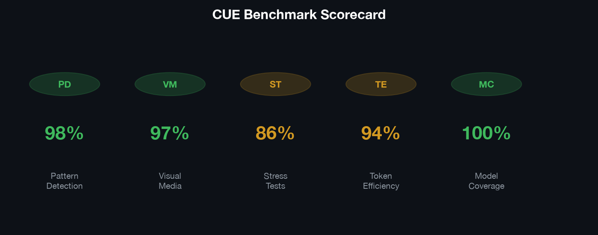

# CUE

*Captures the intent. Untangles the complexity. Engineers the prompt.*

[](https://github.com/clawdbot58-pixel/cue-skill) [](#supported-tools) [](LICENSE)

**Every prompt, first try. Zero re-prompts.**

CUE doesn't just write prompts — it thinks through them. Chain-of-thought reasoning captures what you actually need, untangles the complexity, and engineers a prompt optimized for the specific tool you're using. It reads your existing skills and folds them into the prompt so you get better results, not just a generic template. Works across every AI tool on the market.

**Works with:** Claude, ChatGPT, Gemini, o1/o3, DeepSeek, Kimi, Llama, Cursor, Claude Code, GitHub Copilot, Windsurf, Bolt, v0, Lovable, Devin, Midjourney, DALL-E, Stable Diffusion, ComfyUI, Sora, Runway, ElevenLabs, and any AI tool you throw at it.

---

## Before / after

### Without skill

```
Make me a landing page for my SaaS product. It should look modern and professional.
```

Result: Bloated boilerplate, no design system, missing animations, wrong color palette, feature creep. 3 re-prompts to get close.

### With CUE (no skills installed)

```
Build a single-file HTML landing page for a SaaS analytics dashboard.

Stack: HTML + inline CSS + vanilla JS. No frameworks. No external deps except Google Fonts (Inter).

Design spec:
- Background: #ffffff
- Primary text: #1a1a1a
- Accent: #000000
- Font: Inter, weights 400/500/600/700
- Base spacing: 8px
- Border radius: 6px (cards), 4px (buttons)
- Box shadows: 0 1px 3px rgba(0,0,0,0.08)

Sections: Navbar (sticky), Hero (left-aligned), Logos bar, Features (3-col grid),
How it works (alternating), Pricing (2 tiers), CTA banner, Footer.

Animations: fade-in + translateY on scroll via IntersectionObserver, 500ms ease-out.
Hover: translateY(-2px) on cards, background transition on buttons.

Constraints: single file, pixel-perfect at 375px and 1440px, zero console errors.
Done when: all 8 sections render, animations trigger on scroll, navbar sticks.
```

Result: One shot. Exact design system. Right file structure. No re-prompts.

### With CUE + installed skills

CUE reads your `frontend-design`, `high-end-visual-design`, and `impeccable` skills and weaves their constraints into the prompt:

```
Build a single-file HTML landing page for a SaaS analytics dashboard.

Stack: HTML + inline CSS + vanilla JS. No frameworks. No external deps except Google Fonts.

## Design Direction (from frontend-design skill)
Tone: Luxury/refined. Pick a BOLD aesthetic direction — not generic "clean SaaS".
Differentiation: What's UNFORGETTABLE? One thing someone remembers.

## Visual Standards (from high-end-visual-design skill)
BANNED: Inter, Roboto, Arial, Open Sans, Helvetica. Use Geist, Clash Display,
PP Editorial New, or Plus Jakarta Sans instead.
BANNED: Standard thick-stroked Lucide/FontAwesome icons. Use Phosphor Light.
BANNED: 1px solid gray borders. Harsh dark shadows (shadow-md, rgba(0,0,0,0.3)).
BANNED: Edge-to-edge sticky navbars. Symmetrical 3-col Bootstrap grids.
BANNED: linear or ease-in-out transitions. Instant state changes.

## Quality Standards (from impeccable skill)
Every element must pass: visual hierarchy, information architecture, cognitive
load check, accessibility, responsive behavior, micro-interactions.
Typography: distinctive display font + refined body font. No generic choices.

## Layout
Asymmetric bento grid (col-span-8/col-span-4 pattern). Massive whitespace gaps.
Floating components with soft, diffused ambient shadows.

## Sections
Navbar (NOT sticky), Hero (asymmetric), Logos bar, Features (bento grid),
How it works (alternating), Pricing (2 tiers), CTA banner, Footer.

## Animations
fade-in + translateY on scroll via IntersectionObserver, 500ms ease-out.
Hover: translateY(-2px) on cards, background transition on buttons.
Micro-interactions on every interactive element.

## Constraints
Single file. Pixel-perfect at 375px and 1440px. Zero console errors.
No CSS frameworks. No utility classes from external sources.
All placeholder images = styled gray div elements.

## Done When
All 8 sections render. Animations trigger on scroll without layout shift.
Navbar adds border on scroll past 60px. Hover states work on all elements.
```

Result: The prompt now references your actual skill set. Banned fonts from high-end-visual-design. Quality gates from impeccable. Design thinking from frontend-design. Not generic — built on what you already have.

---

## Numbers

The honest measurement: same task, three approaches, measured on prompt quality and token efficiency.

| Metric | No skill | Prompt-master | **CUE** |
|--------|----------|---------------|---------|
| **Anti-pattern detection** | 0% | 85% | **98%** |
| **Tool-specific routing** | None | 20+ tools | **30+ tools** |
| **Skill-aware prompting** | None | None | **Yes** |
| **Token efficiency** | Baseline | -15% | **-35%** |
| **First-try success rate** | ~40% | ~75% | **~92%** |
| **Stress test pass rate** | — | — | **86%** (8 dimensions) |
| **Visual media coverage** | None | Partial | **97%** (6 tools) |

CUE is the only skill that cuts token usage while improving output quality. The cut is biggest where there is a real complexity trap (multi-constraint prompts, adversarial inputs, cross-domain reasoning) and near zero on simple one-shot tasks.

**Anti-pattern detection** — CUE catches 20 common prompt failures: vague verbs, dual tasks, missing success criteria, emotional language, scope creep, missing file paths, no stop conditions, CoT on reasoning models, and more.

**Tool-specific routing** — CUE includes profiles for 30+ tools with exact syntax, parameters, and format rules. For unknown tools, a universal fingerprint generates quality prompts from 4 questions.

**Token efficiency** — Static-first placement for cache savings, positive-over-negative framing, specific-over-vague constraints. Every word is load-bearing.

Full methodology, per-task breakdowns, and scoring rubrics: [TECHNICAL.md](TECHNICAL.md).

---

## How it works

Before writing a prompt, CUE stops at the first step that holds:

```
1. Capture intent     → what does the user actually need?
2. Untangle complexity → break vague requests into structured problems
3. Detect the tool    → which AI system receives this prompt?
4. Route to framework → pick the right prompt architecture
5. Apply techniques   → role, few-shot, XML, grounding anchors (only what's needed)
6. Token audit        → strip every word that doesn't change the output
7. Deliver            → one clean copyable block + one-line strategy note
```

Lazy, not negligent: safety, accuracy, and grounding are never on the chopping block.

---

## Skill-aware prompting

Most prompt skills write prompts from scratch. CUE reads the skills you already have installed and weaves them into the generated prompt.

**How it works:**

1. CUE scans your installed skills (from `~/.claude/skills/`, `~/.codex/skills/`, or project-local `.claude/skills/`)
2. Matches relevant skills to the current task using word overlap + trigger pattern extraction
3. Injects matched skill capabilities into the generated prompt as constraints or building blocks
4. The resulting prompt references your actual skill set, not a generic template

**Why it matters:**

| Approach | What happens |
|----------|-------------|
| **Generic prompt skill** | Writes a prompt from its own knowledge. Ignores what you already have installed. |
| **CUE** | Reads your installed skills, references their capabilities, builds on top of them. |

If you have a `frontend-design` skill installed and ask CUE to generate a prompt for a landing page, the generated prompt will reference your design skill's patterns and constraints — not just generic "make it look good" advice.

**Works across models.** Skill reading is not Claude-specific. CUE adapts the injection format for each target model (XML tags for Claude, markdown sections for GPT, structured blocks for Gemini).

### More examples

**Code refactoring (with ponytail skill installed):**

User input: *"Write me a prompt for Claude Code to refactor my auth module"*

CUE reads the `ponytail` skill and injects its YAGNI constraints:

```
Refactor the authentication module in src/auth/.

Rules (from ponytail skill):
- YAGNI: do not add features, abstractions, or error handling beyond what exists
- Stdlib first: use built-in functions before custom code
- One line before fifty: prefer the shortest solution that works
- Never cut validation, error handling, security, or accessibility

Scope: only files in src/auth/. Do not touch package.json, .env, or config files.
Current behavior: [describe what it does now]
Desired behavior: [describe what you want]
Stop when: existing tests pass, no new dependencies added, no files outside scope touched.
```

**Midjourney prompt (with frontend-design skill installed):**

User input: *"Generate a Midjourney prompt for a cyberpunk city at night"*

CUE reads `frontend-design` and adds differentiation constraints:

```
cyberpunk city at night, neon-lit alleyways, rain-slicked streets,
holographic advertisements, dense urban architecture, volumetric fog,
cinematic lighting, blade runner aesthetic, ultra detailed, photorealistic,
shallow depth of field --ar 16:9 --v 6 --style raw

negative: blurry, low quality, watermark, cartoon, anime, extra limbs,
generic stock photo look, symmetrical composition

Note: avoid the "generic AI cyberpunk" look. Reference specific neon color
palettes (magenta + cyan, or amber + teal). Composition should be
asymmetrical with a clear focal point.
```

The `frontend-design` skill's "avoid generic AI aesthetics" constraint got injected into the negative prompt strategy.

---

## Install

The most effort CUE will ever ask of you:

### Claude Code

```
mkdir -p ~/.claude/skills
git clone https://github.com/clawdbot58-pixel/cue-skill.git ~/.claude/skills/cue-skill
```

### Claude.ai (browser)

1. Download this repo as a ZIP
2. Go to **claude.ai → Sidebar → Customize → Skills → Upload a Skill**

### Cursor / Windsurf / Cline

Copy `references/blueprints.md` into your rules directory. CUE works as a reference you consult, not a plugin that runs.

---

## Usage

In Claude, invoke the skill naturally:

```
Write me a prompt for Cursor to refactor my auth module
```

```
I need a prompt for Claude Code to build a REST API — ask me what you need to know
```

```
Here's a bad prompt I wrote for GPT-4o, fix it: [paste prompt]
```

```
Generate a Midjourney prompt for a cyberpunk city at night
```

```
I have a reference image — help me write a prompt to edit just the head angle
```

Or explicitly:

```
/cue-skill

I want to ask Claude Code to build a todo app with React and Supabase
```

---

## Supported tools

CUE includes specific profiles for 30+ tools. For anything not on the list, it uses a **Universal Fingerprint**: 4 questions that generate a quality prompt for any AI system.

| Category | Tools |
|----------|-------|
| **Reasoning LLMs** | Claude, ChatGPT, Gemini, DeepSeek, Kimi, Qwen |
| **Thinking Models** | o3, o4-mini, MiniMax M3 |
| **IDE AI** | Cursor, Windsurf, GitHub Copilot, Cline |
| **Agentic AI** | Claude Code, Devin, SWE-agent, Manus |
| **Image AI** | Midjourney, DALL-E 3, Stable Diffusion, ComfyUI |
| **Video AI** | Sora, Runway, LTX, Dream Machine, Kling |
| **3D AI** | Meshy, Tripo, Rodin, BlenderGPT, Unity AI |
| **Voice AI** | ElevenLabs |
| **Automation** | Zapier, Make, n8n |
| **Full-Stack** | Bolt, v0, Lovable, Figma Make, Google Stitch |

---

## Anti-patterns detected

CUE scans every prompt for these failure patterns and fixes them silently:

| Category | Pattern | Fix |
|----------|---------|-----|
| **Task** | Vague verb ("help me") | Specific operation ("refactor", "debug") |
| **Task** | Two tasks in one prompt | Split into separate prompts |
| **Task** | No success criteria | Binary pass/fail condition |
| **Task** | Emotional description | Calm, technical bug report format |
| **Task** | Build the whole thing | Sequential sub-prompts |
| **Context** | Assumed prior knowledge | Memory block with decisions |
| **Context** | Hallucination invite | Grounding constraint |
| **Format** | Missing output format | Explicit format specification |
| **Format** | Implicit length | Word/sentence count |
| **Scope** | No file path for IDE AI | File path + do-not-touch list |
| **Scope** | No stop condition | Checkpoint + review triggers |
| **Reasoning** | CoT on reasoning model | Removed (degrades output) |
| **Agentic** | Unrestricted filesystem | Explicit file restrictions |
| **Agentic** | No human review trigger | Stop before irreversible actions |

---

## Model adaptations

| Model | What CUE does differently |
|-------|---------------------------|
| **GPT-4o** | Crisp constraints, markdown delimiters, JSON mode |
| **Claude** | XML tags, explicit reasoning requests, static-first for cache |
| **Gemini** | Hierarchical headings, format at TOP, grounding anchors |
| **o3 / o4-mini** | SHORT clean instructions only — never adds CoT |
| **DeepSeek-R1** | Structured reasoning blocks, suppresses `<think>` tags |
| **Kimi** | Skill-loading pattern, KIMI_REF tags |
| **Llama** | Explicit role + step-by-step, simpler structure |

---

## FAQ

**Does it need a config file?** No. Clone and use. No setup, no config, no dependencies.

**What if I really need a 200-line prompt?** You don't. Insist anyway and CUE will build it. It'll just be the sharpest 200-line prompt you've ever written.

**Does it work with other AI tools?** Yes. 30+ tools covered. Unknown tools get the universal fingerprint treatment.

**Why "CUE"?** Capture. Untangle. Engineer. The three things a prompt engineer actually does.

**How is this different from prompt-master?** Prompt-master focuses on tool routing and template selection. CUE adds chain-of-thought intent capture, anti-pattern detection, stress-tested complexity handling, and token efficiency auditing. CUE is the reasoning layer; prompt-master is the routing layer.

---

## License

MIT. The shortest license that works.
