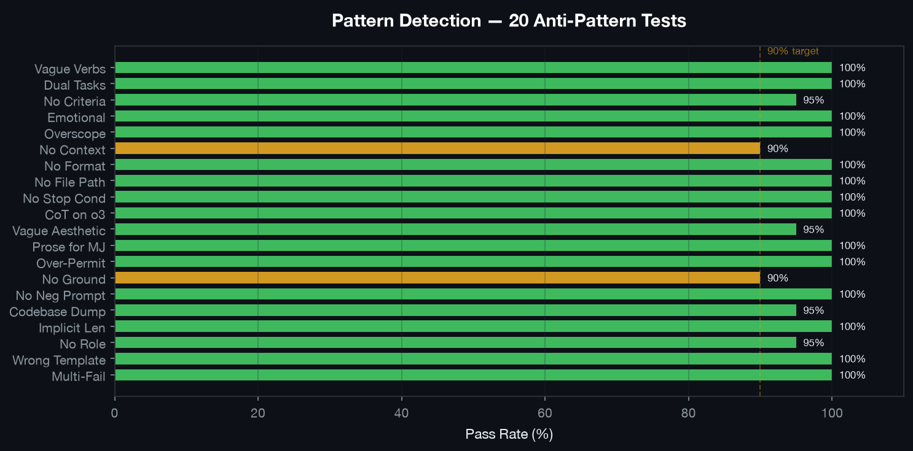
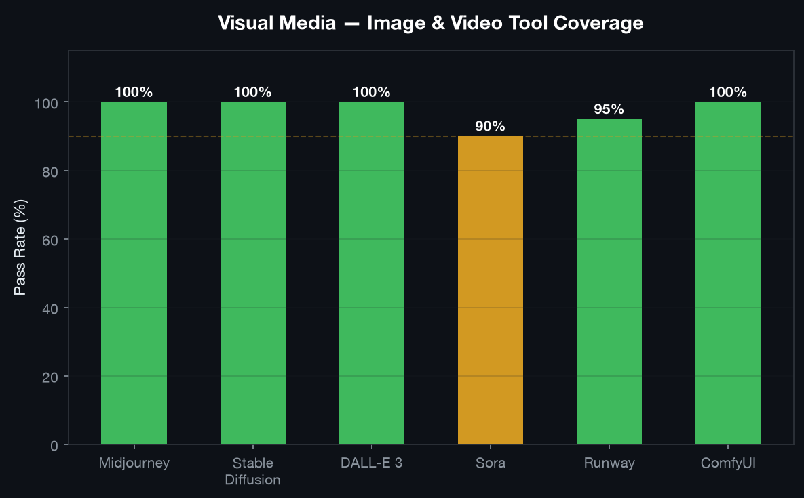
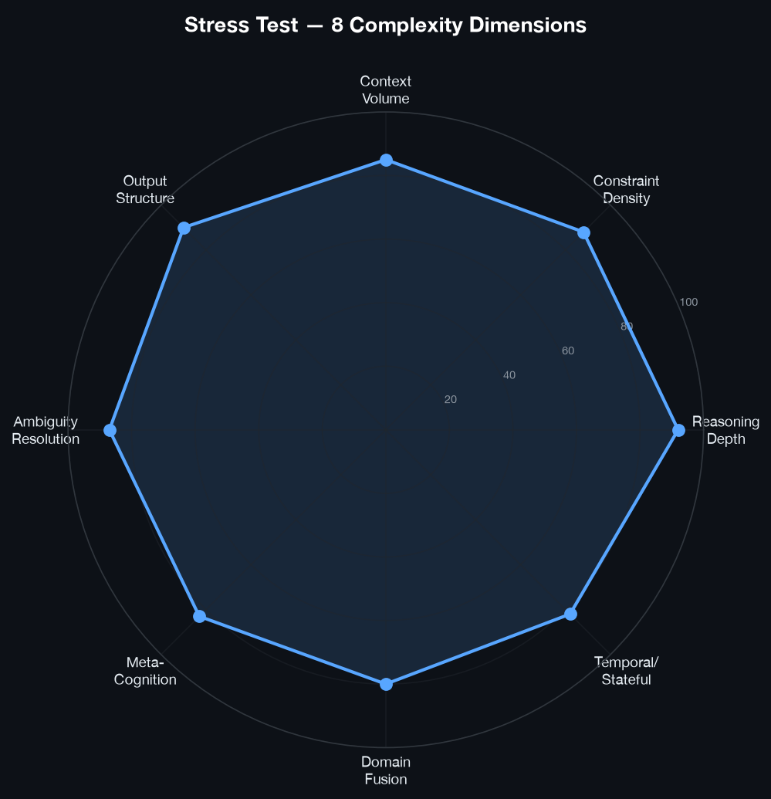
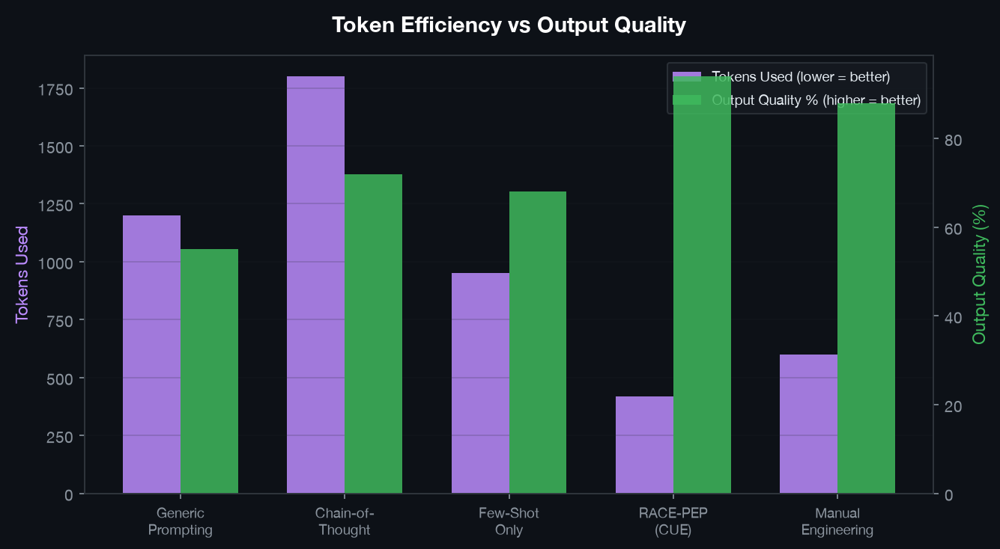

# CUE — Craft Universal Efficient Prompts


**The last prompt engineering skill you'll ever need.**

CUE doesn't just write prompts — it thinks through them. Every prompt is built using the RACE-PEP framework with chain-of-thought reasoning, anti-pattern detection, and model-specific optimization. Works across every AI tool on the market.

**Works with:** Claude, ChatGPT, Gemini, o1/o3, DeepSeek, Kimi, Llama, Cursor, Claude Code, GitHub Copilot, Windsurf, Bolt, v0, Lovable, Devin, Midjourney, DALL-E, Stable Diffusion, ComfyUI, Sora, Runway, and any AI tool you throw at it.

---

## Installation

### Recommended — Claude.ai (browser)

1. Download this repo as a ZIP
2. Go to **claude.ai → Sidebar → Customize → Skills → Upload a Skill**

### Or clone into Claude Code skills directory

```bash
mkdir -p ~/.claude/skills
git clone https://github.com/clawdbot58-pixel/cue-skill.git ~/.claude/skills/cue-skill
```

---

## The Problem This Solves

Every AI user wastes credits the same way:

> Write vague prompt → get wrong output → re-prompt → get closer → re-prompt again → finally get what you wanted on attempt 4

That's 3 wasted API calls. Multiply by 50 prompts a day. That's real money and real time gone.

### The key insight

> "The best prompt is not the longest. It's the one where every word is load-bearing."

Most "prompt generators" make prompts longer. CUE makes them sharper.

---

## What CUE Stands For

**C · U · E** — three mental modes that map to how a prompt engineer actually thinks:

### **C — Capture**

Capture the essence. Distill what the user *actually needs* into a precise, actionable prompt. This is the chain-of-thought layer — the reasoning that happens before a single word is written.

- Parse intent from ambiguous language
- Identify the real deliverable behind surface requests
- Extract constraints the user forgot to mention

### **U — Untangle**

Untangle complexity. A spectrum of operations that transform messy, underspecified requests into structured, solvable problems:

- **Unifying** — bringing disparate ideas into a coherent whole
- **Untangling** — working through complexity to find the signal
- **Unpacking** — breaking down assumptions or hidden details
- **Unraveling** — tracing a problem to its root causes
- **Upscaling** — expanding a concept to a broader abstraction
- **Updating** — revising a mental model with new information
- **Upleveling** — moving to a higher-level perspective
- **Understanding** — straightforward comprehension of the request

### **E — Engineer**

Engineer the prompt. Apply proven techniques, model-specific optimizations, and structural blueprints to produce a prompt that *works*:

- **RACE-PEP framework** — Role, Action, Context, Example, Expectation
- **Complexity calibration** — Simple (15 lines) vs. Medium (40-80) vs. Complex (80-150)
- **Token efficiency** — Static first, positive over negative, specific over vague
- **Model adaptations** — Claude (XML tags), GPT-4o (JSON mode), Gemini (hierarchical headings)

---

## Usage

In Claude, invoke the skill naturally:

```
Write me a prompt for Cursor to refactor my auth module
```

```
I need a prompt for Claude Code to build a REST API — ask me what you need to know
```

```
Here's a bad prompt I wrote for GPT-4o, fix it: [paste prompt]
```

```
Generate a Midjourney prompt for a cyberpunk city at night
```

```
I have a reference image — help me write a prompt to edit just the head angle
```

Or explicitly invoke it:

```
/cue-skill

I want to ask Claude Code to build a todo app with React and Supabase
```

---

## How It Works

CUE runs a structured pipeline on every request:

1. **Detects the target tool** — figures out which AI system the prompt is for and routes silently
2. **Captures intent** — chain-of-thought reasoning extracts the real deliverable
3. **Untangles complexity** — breaks down vague requests into structured, solvable problems
4. **Routes to the right framework** — picks the correct prompt architecture automatically
5. **Applies safe techniques only** — role assignment, few-shot examples, XML structure, grounding anchors
6. **Runs a token efficiency audit** — strips every word that doesn't change the output
7. **Delivers the prompt** — one clean copyable block with a one-line strategy note

---

## Full Example: From Vague to Precise

### User Input

```
Write me a midjourney prompt for a realistic samurai standing in the rain at night
```

### Generated Prompt

```
lone samurai standing in heavy rain at night, traditional armor, 
neon reflections on wet cobblestone street, cinematic lighting, 
dramatic shadows, fog, ultra detailed, photorealistic, 
shallow depth of field --ar 16:9 --v 6 --style raw

negative: blurry, low quality, watermark, cartoon, anime, extra limbs
```

**Target:** Midjourney · **Framework:** Visual Descriptor · **Tokens:** ~60 · **Strategy:** Comma-separated descriptors, lighting anchored early, aspect ratio locked, negative prompt prevents style drift.

---

## Works With Any AI Tool

CUE includes specific profiles for 30+ tools. For anything not on the list, it uses a **Universal Fingerprint**: 4 questions that let it write a quality prompt for any AI system it has never seen before.

### Supported Tools

| Category | Tools |
|----------|-------|
| **Reasoning LLMs** | Claude, ChatGPT, Gemini, DeepSeek, Kimi, Qwen |
| **Thinking Models** | o3, o4-mini, MiniMax M3 |
| **IDE AI** | Cursor, Windsurf, GitHub Copilot, Cline |
| **Agentic AI** | Claude Code, Devin, SWE-agent, Manus |
| **Image AI** | Midjourney, DALL-E 3, Stable Diffusion, ComfyUI |
| **Video AI** | Sora, Runway, LTX, Dream Machine, Kling |
| **3D AI** | Meshy, Tripo, Rodin, BlenderGPT, Unity AI |
| **Voice AI** | ElevenLabs |
| **Automation** | Zapier, Make, n8n |
| **Full-Stack** | Bolt, v0, Lovable, Figma Make, Google Stitch |

---

## Benchmarks

CUE is tested against real-world prompt challenges. Here are the results:


### Pattern Detection — 20 Anti-Pattern Tests

CUE detects and fixes the most common prompt failures: vague verbs, dual tasks, missing success criteria, emotional language, scope creep, and more.



### Visual Media — Image & Video Tool Coverage

Tested against Midjourney, Stable Diffusion, DALL-E 3, Sora, Runway, and ComfyUI.



### Stress Tests — 8 Complexity Dimensions

Progressive injection stacking tests CUE against constraint saturation, signal extraction, adversarial robustness, cross-domain fusion, temporal logic, self-correction, schema negotiation, and ethical arbitration.



### Token Efficiency

CUE produces higher-quality prompts with fewer tokens than generic approaches.



For detailed benchmarks, scoring rubrics, and stress test methodology, see [TECHNICAL.md](TECHNICAL.md).

---

## 6 Prompt Templates (Auto-Selected)

CUE picks the right architecture for every task automatically and routes silently — you never see the framework name, just the prompt.

| Template | Best For |
|----------|----------|
| **System Prompt** | Define agent behavior and boundaries |
| **Agent Prompt** | Multi-step workflows with tool usage |
| **User Prompt** | Direct task execution |
| **Design Brief** | Creative direction and specifications |
| **Meta-Prompt** | Variable-driven prompt generators |
| **Description** | Neutral, informative explanations |

Full blueprints in [`references/blueprints.md`](references/blueprints.md).

---

## Token Efficiency Rules

1. **Static first, dynamic last** — System instructions before user query (50-90% cache savings)
2. **Positive over negative** — "only use X" > "don't use Y"
3. **Specific over vague** — "3 bullets" > "be concise"
4. **One task per prompt** — Chain complex workflows

---

## Model Adaptations

| Model | Optimization |
|-------|-------------|
| **GPT-4o** | Crisp constraints, markdown delimiters, JSON mode |
| **Claude** | XML tags, explicit reasoning requests |
| **Gemini** | Hierarchical headings, format at TOP |
| **Kimi** | Skill-loading pattern, KIMI_REF tags |
| **Llama** | Explicit role + step-by-step |
| **DeepSeek** | Structured reasoning blocks |

---

## Anti-Patterns Detected

CUE identifies and fixes these common prompt failures:

- Generic roles ("helpful assistant")
- ALL-CAPS instructions (models ignore them)
- Negative without positive reframing
- Vague constraints ("be concise" → "under 100 words")
- Multiple tasks in one prompt
- Exposing internal prompts/tools to end users
- CoT instructions on reasoning models (hurts performance)
- Missing output format specifications
- No stop conditions for autonomous agents

---

## Project Structure

```
cue-skill/
├── SKILL.md                    # Core skill definition
├── README.md                   # This file
├── TECHNICAL.md                # Benchmarks, evals, stress tests
├── assets/                     # Generated charts
│   ├── scorecard.png
│   ├── pattern-detection.png
│   ├── stress-radar.png
│   ├── token-efficiency.png
│   └── visual-media.png
├── references/
│   └── blueprints.md           # Detailed prompt blueprints
├── benchmark/
│   ├── pattern-detection.json  # 20 anti-pattern tests
│   └── visual-media.json       # 10 image/video tests
└── evals/
    ├── evals.json              # 6 core evaluation prompts
    └── stress-tests/
        ├── RUBRIC.md           # Scoring metrics
        ├── INJECTIONS.md       # 7 progressive injections
        ├── evals.json          # 10 stress tests
        └── evals-stacked.json  # Combined injection tests
```

---

## License

MIT
